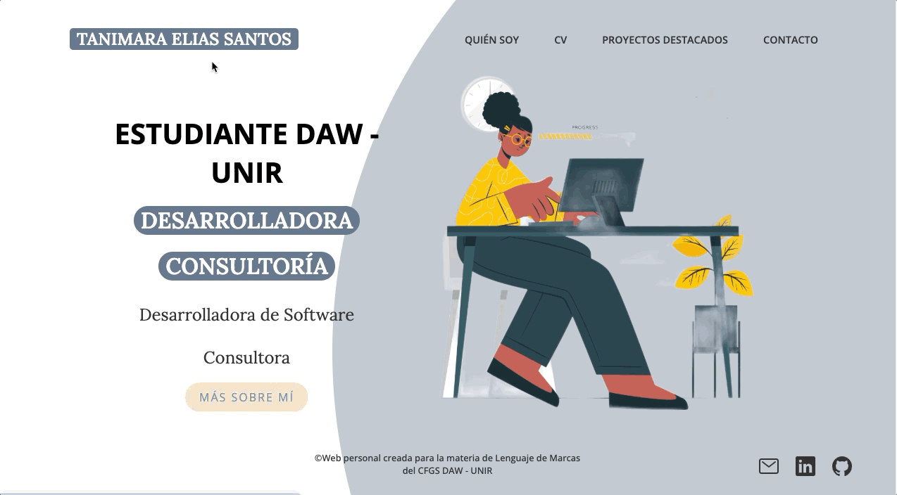

# Actividad 4 - Creación Landing Page Personal

## Introducción

Este proyecto es una página personal para mi perfil profesional como desarroladora. La web ofrece contenido relacionado con mi perfil, mi CV actualizado, mis últimos proyectos y un formulario de contacto.

## Objetivos

Con la realización de esta actividad, se pretende asentar los conocimientos de HTML y CSS vistos en la materia de Lenguaje de Marcas y Sistemas de Gestión, con la realización de una web personal en donde se muestren las competencias y conocimientos adquiridos por los alumnos.

### Requerimiento 1

Realización de la Landing Page sólo según lo visto en el <a href="https://youtu.be/Qdj5jOzT7MU">vídeo</a> fornecido por el profesor.

### Requerimiento 2

Una galería con los proyectos que habéis hecho de todas las materias (Marcas, ED, Programación. BBDD, Sistemas, etc) y que den valor añadido a vuestra web.

## Requerimiento 3

Un formulario con HTML y CSS que permita contactar con vosotros, aunque en la página principal tengáis el link.

**Mira la aplicación online [aquí](https://tanimaraeliassantos.github.io/proyecto-web-personal-tanimara-es-daw/).**

## Características

- Página principal con elementos vistos en el vídeo enviado por el profesor
- Páginas secundarias con informaciones sobre mi, un CV, proyectos realizados durante el curso, y un formulario para contacto.

## Technologies

- CSS
- HTML

### Autora

[Tanimara Elias Santos](https://github.com/tanimaraeliassantos)

### Versión

1.0.0
